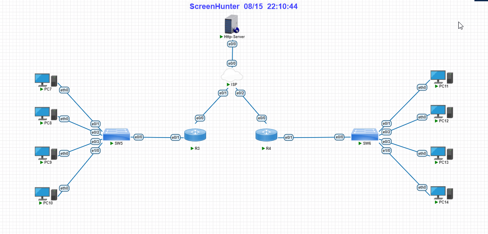

# NAT vs PAT Lab — Static NAT, Dynamic NAT Pool Exhaustion & PAT Overload

A hands-on Cisco IOS lab built in **pnetlab**, designed to demonstrate the practical differences between **Static NAT**, **Dynamic NAT**, and **PAT (NAT Overload)** — not just the theory, but real, observable behavior including pool exhaustion.

## 🎯 Lab Objectives

- Configure and verify **Static NAT** (1-to-1 mapping)
- Configure and verify **Dynamic NAT** with a limited IP pool, and deliberately trigger **pool exhaustion**
- Configure and verify **PAT / NAT Overload**, showing multiple internal hosts sharing a single public IP via port translation
- Compare scalability: a small IP pool vs. a single overloaded IP
- Practice troubleshooting (interface down states, routing between edge routers via a central ISP node)

## 🖧 Topology



| Node | Role |
|---|---|
| **ISP** | Central hub router simulating the internet core — directly connected to R3, R4, and Http-Server |
| **Http-Server** | Simulates a remote internet host (Cisco `ip http server` used as an HTTP target) |
| **R3** | Office A edge router — Static NAT + Dynamic NAT Pool |
| **R4** | Office B edge router — PAT / NAT Overload |
| **SW5 / SW6** | Access switches for each office LAN |
| **PC7–PC10** | Office A hosts (behind R3) |
| **PC11–PC14** | Office B hosts (behind R4) |

## 📋 IP Addressing Plan

| Link | Subnet | Addresses |
|---|---|---|
| ISP (e0/0) ↔ Http-Server (e0/0) | 203.0.113.0/30 | ISP: .1, Server: .2 |
| ISP (e0/1) ↔ R3 (e0/0) | 203.0.113.16/28 | ISP: .17, R3: .18, Static NAT: .19, Pool: .20–.21 |
| ISP (e0/2) ↔ R4 (e0/0) | 203.0.113.32/30 | ISP: .33, R4: .34 (also used for PAT overload) |
| R3 (e0/1) ↔ SW5 ↔ PC7–10 | 192.168.10.0/24 | R3: .1, PC7: .11 (Static), PC8: .12, PC9: .13, PC10: .14 |
| R4 (e0/1) ↔ SW6 ↔ PC11–14 | 192.168.20.0/24 | R4: .1, PC11: .11 … PC14: .14 (all PAT) |

## ⚙️ Configuration Summary

Full configs are in [`/configs`](./configs).

**R3 — Static NAT (PC7) + Dynamic NAT Pool (PC8–PC10, only 2 public IPs)**
```
ip nat inside source static 192.168.10.11 203.0.113.19
ip nat pool DYNAMIC-POOL 203.0.113.20 203.0.113.21 netmask 255.255.255.240
ip nat inside source list NAT-POOL-ACL pool DYNAMIC-POOL
```

**R4 — PAT / Overload (PC11–PC14, single public IP)**
```
ip nat inside source list PAT-ACL interface e0/0 overload
```

Routing: since R3, R4, and Http-Server each have a single exit point, a simple default route toward the ISP handles all off-subnet traffic — the ISP router holds direct connected routes to every subnet and acts as the hub.

## 🔍 Key Findings

1. **Static NAT** gives a permanent, predictable 1-to-1 mapping — ideal for servers that must always be reachable at the same public IP.
2. **Dynamic NAT with a limited pool (2 IPs for 3 hosts)** hits **pool exhaustion**: only 2 of 3 hosts get a translation at a time. `show ip nat statistics` confirms this with a non-zero **misses** counter on the pool.
3. **PAT (NAT Overload)** scales far better with the same or fewer public IPs — all 4 Office B hosts stayed online simultaneously, each distinguished by a unique source port on the same public IP.
4. This is the core practical argument for PAT in real-world deployments: **NAT is limited by IP count, PAT is limited by port count** (~64,000 ports per IP) — which is why PAT is the default choice for most internet-facing edge routers today.

## 📸 Screenshots

| image | Shows |
|---|---|
| `01-static-nat-translation.png` | `show ip nat translations` — PC7 mapped permanently to 203.0.113.19 |
| `02-dynamic-nat-pool-exhaustion.png` | `show ip nat statistics` — pool at 100% allocation, misses counter increasing |
| `03-pat-overload-translations.png` | `show ip nat translations` on R4 — 4 hosts, 1 IP, different ports |
| `04-final-verification.png` | End-to-end ping/HTTP test results |

## 🛠️ Tools Used

- pnetlab (Cisco IOSv routers)
- SecureCRT for console access
- Cisco IOS NAT/PAT commands

## 📚 What I'd Explore Next

- NAT with a AAA/DHCP-integrated pool
- Port forwarding for a specific service on a PAT-overloaded interface
- IPv6 and NAT64 comparison

---

*Built as a self-study lab to reinforce NAT/PAT concepts for CCNA-level networking.*
